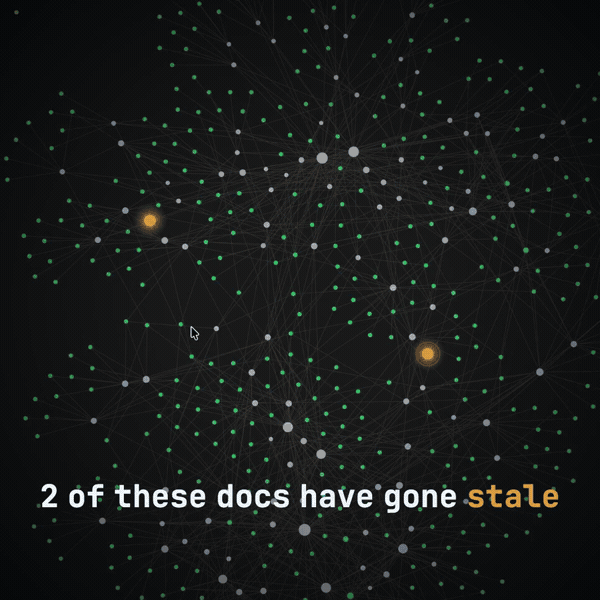

# Growth Garage Toolkit

A growing collection of the tools, agent skills, and hard-won techniques I use to ship
production software fast — extracted from real products, cleaned up, and open-sourced one
at a time.

Each folder in [`skills/`](./skills) is self-contained: its own README, its own demo, drop
it into your own project. No framework to buy into, no account to sign up for.

New skill drops roughly once a week — **star the repo** to catch each one.



*Above: the [`kb`](./skills/kb-cli) skill in action — one command audits your entire knowledge base and catches what's gone stale.*

---

## What's inside

| Skill | What it gives you | The number | Status |
|-------|-------------------|-----------|--------|
| [**kb-cli**](./skills/kb-cli) | A knowledge base for AI agents that maintains itself — flags its own stale/low-confidence articles and compiles into every IDE's config from one source | Runs a 107-article KB at ~29-day avg freshness | ✅ **Available now** |
| [**living-system-map**](./skills/living-system-map) | Lets your agent answer "how does this work?" with a clickable map instead of six paragraphs. It traces the code on demand, breaks open only the parts that are actually fiddly, and ships one self-contained HTML file | One file · zero dependencies · any stack | ✅ **Available now** |
| **gpu-particle-morph** | Smooth 1M+ point WebGL particle systems that survive weak devices — GPU vertex-shader morphs, int16-quantized attributes | 1.1M points · 16.5ms → 9.5ms frame time | 🔜 Week 1 |
| **svg-to-compositor** | Move SMIL/paint-thread SVG animations onto the compositor for free frames | 15fps → 60fps | 🔜 Week 1 |
| **claude-code-hooks** | Three hooks that stop Claude Code from wasting tokens: read-once dedup, KB auto-load, cheap-model delegation | 3 hooks, measurable token drop | 🔜 Week 2 |
| **bookmark-harvest** | A ruthless AI triage that turns a pile of saved bookmarks into verified, agent-readable skill notes | 2,411 in → 22% kept | 🔜 Week 2 |
| **content-visibility** | The two-line CSS first-paint win most people skip — plus the sticky-position gotcha and its fix | 232ms → 30ms first paint | 🔜 Week 3 |
| **gg-proposal** | A scroll-driven, brand-matched proposal site template that replaces the sales deck | Lighthouse 95, built in a day | 🔜 Week 3 |

> Status reflects the public rollout — skills land here alongside the thread that explains
> them. The numbers are real, measured in production.

---

## How to use a skill

Every skill folder stands alone. Clone the repo (or just copy the one folder you want):

```bash
git clone https://github.com/JakePaterson/growth-garage-toolkit.git
cd growth-garage-toolkit/skills/kb-cli
cat README.md
```

Skills that are **runnable tools** (like `kb-cli`) have their own install steps.
Skills that are **techniques** ship a reference implementation plus a `SKILL.md` you can
hand straight to an AI coding agent.

---

## Who makes this

Built by [Growth Garage](https://growthgarage.dev) — a small studio that builds fast,
polished web products. These are the reusable pieces pulled out of that work.

Follow along as new skills drop: **[@trippedjake on X](https://x.com/trippedjake)**

---

## License

[MIT](./LICENSE) — use it, ship it, no attribution required (though a star is always welcome).
